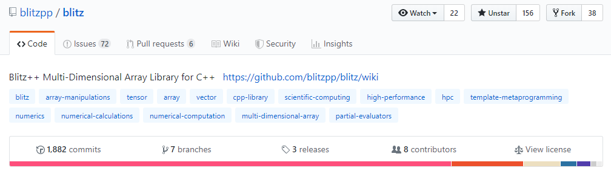

# Environment

分别在Windows和Linux（虚拟机）上都做了相关探究。

## Windows

+ CPU: AMD Ryzen 5 2600 Six-Core Processor **(6C12T)**
+ RAM: **48.0GiB**
+ OS: Windows 10 专业版
+ IDE: Visual Studio Community 2019 
+ Compiler: MSVC 1923, **ICC 19.0**
+ Tool: **Intel Advisor 2019**

## Linux

+ vCPU: AMD Ryzen 5 2600 Six-Core Processor **(4C8T)**
+ RAM: 16.0GiB
+ OS: Ubuntu 19.04
+ Editor: Visual Studio Code
+ Compiler: GCC 8.3.0
+ Tool: make

# Solution

1.  **成功编译该代码** 

进入相关目录make即可


2.  **成功运行该串行代码，并得到串行代码的结果文件check.txt** 

make后运行即可


这里会发现Linux上运行这个程序第一次和非第一次的运行时间差的非常多，这里我估计是Linux存在一个「内存缓存」的机制，第一次运行之后这个程序可能放在了cache里面，之后每次运行的时间基本稳定。Windows没有「内存缓存」的机制，所以没有这个问题（至少我没有遇到）。

这里因为每次要`make clean`然后再`make`然后再运行（有时还得切换目录），有点麻烦，考虑写个bash脚本方便一点：


3.  **了解该函数的基本原理** 

`evaluateWithStackTraversalN`函数主要作用是对多维数组进行update，这里的update一共有若干种（一元运算`-`，二元运算`=,+,-,*,/`）。

`evaluateWithStackTraversalN`函数的实现方法是用栈来代替显式的多重循环，不断展开循环，最终用一层循环来对所有元素进行update操作。

4. + **将该函数`evaluateWithStackTraversalN`并行化**
   + **成功编译修改后的并行代码**
   + **成功运行并通过精度检查** 
   + **下载Intel Parallel Studio XE**

我这里首先使用了Visual Studio的**性能探查器**，寻找代码的效率瓶颈


可以发现（我认为的）代码效率主要在这个一重循环处，所以当务之急是优化这个for循环

这里考虑了一些优化方法：

## openmp多线程并行化for循环

由于openmp写起来相对简单一些，所以这里直接先使用openmp进行并行化尝试：

首先需要对openmp的使用进行配置，这里Linux和Windows（VS2019）的操作不太相同，Linux需要在Makefile里面添加相关参数

```makefile
TARGET=FYArray.exe

CXX=g++

CFLAGS=-O3 -std=c++11
LDFLAGS=-fopenmp -lgomp -pthread//这里加了一些参数

INCLUDE=../include

OBJ=FYStorage.o main.o

$(TARGET):$(OBJ)
	$(CXX) $(LDFLAGS) $^ -o $@
	# cp $(TARGET) ../

%.o:%.cpp
	$(CXX) $(LDFLAGS) -I $(INCLUDE) -c $(CFLAGS) $< -o $@ 

.PHONY:clean
clean:
	rm *.o -f
```

VS2019里面只需要在属性里面打开相关开关即可：


然后在源代码中包含`<omp.h>`即可

接着添加相关代码：

```cpp
#ifdef OMP//使用宏来方便开关这个优化
    omp_set_num_threads(8);
#pragma omp parallel for
#endif
    for (int i = 0; i < ubound; ++i)
    {
    	T_update::update(data[i], expr.fastRead(i));
    }
```

运行发现，无论是在Windows还是Linux上，效果都十分显著——程序变慢了许多


这里估计是因为等待多线程同步的时间过长，导致多线程反而慢于单线程

## 手动循环展开 Loop Unrolling

在试验了若干天上述的openmp「优化」之后，我终于放弃，开始尝试别的技巧。

这里尝试了原来打OI的时候学的一种技巧——「循环展开」。

这里实现了两个版本的四层循环展开

第一种：

```cpp
#else
					int n1 = ubound & 3;
					int i = 0;
					for (; i < n1; ++i)
						T_update::update(*data++, expr.fastRead(i));
					for (; i < ubound; i += 4)
					{
#ifndef ANTIALIAS
						T_update::update(*data++, expr.fastRead(i));
						T_update::update(*data++, expr.fastRead(i + 1));
						T_update::update(*data++, expr.fastRead(i + 2));
						T_update::update(*data++, expr.fastRead(i + 3));
```

第二种：

```cpp
#else
						const int t1 = i + 1;
						const int t2 = i + 2;
						const int t3 = i + 3;
						auto tmp1 = expr.fastRead(i);
						auto tmp2 = expr.fastRead(t1);
						auto tmp3 = expr.fastRead(t2);
						auto tmp4 = expr.fastRead(t3);
						T_update::update(*data++, tmp1);
						T_update::update(*data++, tmp2);
						T_update::update(*data++, tmp3);
						T_update::update(*data++, tmp4);
#endif
```

很遗憾，效率没有获得任何提升，相反略有下降。这里估计是因为存在一些依赖关系，导致无法直接并行


## SIMD 向量化

前面两类「优化」消耗了我大部分时间，但却没有产生正面作用。于是我开始向外寻求帮助，包括使用搜索引擎（Google/Github搜索）和向学长求助。

首先根据代码中的注释可以看出这段代码应该是来源于一个用于科学计算的库，于是Github搜索一下有特征的函数名：


可以推测应该是来自[这个仓库]( https://github.com/blitzpp/blitz )



发现核心代码已经很久没commit了（逃，并且最新版本里面已经没有`evaluateWithStackTraversalN`这个函数了，看样子作者已经优化过了（准备参bai考piao）。

clone下来之后，经过一番搜索+阅读可以找到对应的位置：


可以发现API都变了（难怪函数名也变了，不过大体上还是差不多的，同样也是分了两类来`evaluate`：分别是一维的和多维的情况，做了特化。一维的情况：


下面就看需要优化的部分，作者的船新版本是如何做的：


前面都大体上没变（不过把`ubound`从`int`改成了`diffType`，更加像标准库了），这里又根据情况分了两个函数来处理：分别是当使用`UnitStride`单独的步长和使用`CommonStride`公共的步长的情况。

通过对题目代码进行测试（输出调试）可以知道`useCommonStride == 0 && useUnitStride == 1`总是成立的，于是我们这里就只关心`_bz_evaluateWithUnitStride`了。

接着就阅读`_bz_evaluateWithUnitStride`，略过一堆调试用的宏，可以发现逻辑比较清晰：


根据459行的宏的名字`BZ_USE_ALIGNMENT_PRAGMAS`猜测应该是做了某种对齐。~~（感觉这不就是循环展开吗）~~

第一个和第三个箭头处不必说，就是处理无法对齐的部分的，第二部分针对对齐的部分再次调用了别的函数，再次进入查看：


可以看到中间又套了一层，看上去似乎是分了「大小够不够一次展开的运算」来做了个分支，结果发现这个宏是0，那不妥妥地要展开了...


再进入这个`evaluate_aligned`函数应该就一目了然了：


可以看到这里用了两个优化参数：

```cpp
#pragma ivdep
#pragma vector aligned
```

查询一下可以知道，第一个参数想让编译器忽略循环之间的依赖关系~~（强行并行？）~~ ，第二个参数是提示编译器进行**向量化**。

这里启示了我使用SIMD优化，再一联想到似乎题目里给的都是`double`的运算，感觉这个地方存在优化的空间。

我先仿照着把原来的一重循环拆成了两重循环，然后加上一样的优化参数：

```cpp
  template<typename T_numtype, typename T_expr, typename T_update>
  void
  evaluate_aligned(T_numtype* data, T_expr &expr, T_update) {
#pragma ivdep
#pragma vector aligned
	  for (int i = 0; i < VECTORIZED_LOOP_WIDTH; ++i)
			  T_update::update(data[i], expr.fastRead(i));
  }
```

这里的`VECTORIZED_LOOP_WIDTH`定义为32，原因是我的CPU（Ryzen5 2600）最高只支持到AVX2指令集，寄存器宽度为256，正好是32个double。

（更高级的AVX512指令集寄存器宽度达到了512，理论上可以效率更高，但是目前来说支持AVX512指令集的CPU比较少，基本上就是至强、HEDT平台和最新的酷睿Ice Lake，假十代i7-10710U之类的也不支持）

不过我看了看原作者的代码，也设置为了32，看来作者认为大家应该都用不起AVX512（逃

这里又走了一些弯路，大概是MSVC的设置问题，在学长的建议下，换用了`Intel Parallel Studio XE`（当然还有icc）。~~打开了新世界的大门~~

## 使用Intel Advisor来向量化

安装完成后再进入VS2019，点击工具里的Intel Advisor 2019，接着摸索了一下大概操作，按照它的 ***Vectorization Advisor*** 建议来进行了一些设置，包括开启AVX2指令集，开启一些优化开关等，随后改用了Intel C++来编译代码。


总体上操作比较直观~~（点各种Collect就完事了）~~，然后运行，发现效率上有一些提升：


虽然不是很明显，不过到这一步应该已经算完成了「并行化」的目标了。

同时Intel Advisor也给了很多统计数据以及一些优化建议：


便于进一步的优化。

~~（感谢Intel，下一代一定支持）~~

# Miscellaneous

一些其他方面的记录。

## 计时

### rdtsc

原代码给的计时代码：

```cpp
inline unsigned long long rdtsc(void)
{
	unsigned long hi = 0, lo = 0;
	__asm__ __volatile__("lfence;rdtsc" : "=a"(lo), "=d"(hi));
	return (((unsigned long long)lo)) | (((unsigned long long)hi) << 32);
}
```

这里用的是手动内联汇编实现的~~（但MSVC的内联汇编语法不一样啊摔）~~，这里我查到有个跨平台的函数（即使不同平台上包含它的头文件不太相同）`__rdtsc`可以调用，并且实现也是内联汇编，所以改写了一下：

```cpp
#ifdef _WIN32
#include <intrin.h>
#else
#include <x86intrin.h>
#endif

inline unsigned long long rdtsc(void)
{
	return __rdtsc();//for cross-platform
}
```

~~不过并没啥用，因为最后我也没用MSVC:)~~

不过后来在使用openmp多线程运行程序的时候，发现这个函数计时产生的误差过大（指与目测相比较），查阅了一番资料发现，rdtsc是用CPU时钟周期数（Time Stamp Counter） 来计数的。但是在如今的多核时代，不同核的TSC不一定是同步的（在一个程序占用多个线程的时候，可能最初调用rdtsc和最终调用rdtsc的不是同一个核心），并且指令在**物理上**也并不总是顺序执行的。因此，**可能**并行化之后不太适合继续用rdtsc计时。

### chrono

C++11有个新库`<chrono>`，最高可达`ns`级别的精度。

没有来得及了解`chrono`的实现，不过倒是抄了一些宏来方便使用

```cpp
#include <chrono>

#define TIMERSTART(tag)  auto tag##_start = std::chrono::steady_clock::now(),tag##_end = tag##_start
#define TIMEREND(tag)  tag##_end =  std::chrono::steady_clock::now()
#define DURATION_s(tag) printf("%s costs %d s\n",#tag,std::chrono::duration_cast<std::chrono::seconds>(tag##_end - tag##_start).count())
#define DURATION_ms(tag) printf("%s costs %d ms\n",#tag,std::chrono::duration_cast<std::chrono::milliseconds>(tag##_end - tag##_start).count());
#define DURATION_us(tag) printf("%s costs %d us\n",#tag,std::chrono::duration_cast<std::chrono::microseconds>(tag##_end - tag##_start).count());
#define DURATION_ns(tag) printf("%s costs %d ns\n",#tag,std::chrono::duration_cast<std::chrono::nanoseconds>(tag##_end - tag##_start).count());
```

调用方法比较简单，最终测试发现多核程序运行时间基本与目测的相近。

## 精度检查

这里可能是检查部分代码有些小bug，导致我在MSVC下运行打印出的结果`check.txt`在icc下运行精度检查并不能通过的尴尬情况。暂时没研究原因，怀疑与不同编译器对浮点处理的不同。


# Summary

这次做招新题，总体上感觉学到了一些东西，不过也发现自己实在是太水了，挺多东西都不会的，不过还是投入了很多时间，在中间一段瓶颈期也不断尝试，最终也算获得了一个差强人意的结果。

也希望最终自己能够通过招新，为HUST的超算队贡献一份力量。

同时也感谢为了提供了很多帮助和指导的zzx学长，以及和我一同做招新题的zyf，sts等同学，谢谢你们！

> We're here to put a dent in the universe.

